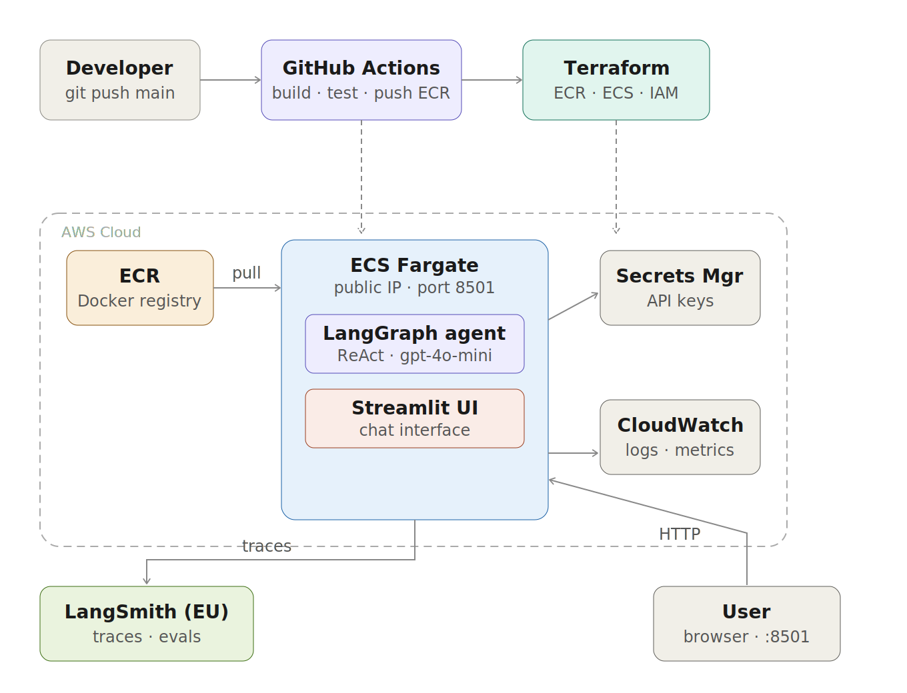

# LangChain Agent on AWS

> A production-grade AI agent built with LangGraph, deployed on AWS ECS Fargate, with full CI/CD via GitHub Actions and infrastructure managed by Terraform. Traces every run to LangSmith.

---

## Architecture



---

## What this project demonstrates

- Building a **ReAct agent** with LangGraph and OpenAI GPT-4o-mini
- Serving it through a **Streamlit chat interface**
- **Containerising** the app with Docker
- **Provisioning AWS infrastructure** (ECR, ECS Fargate, IAM, CloudWatch) with Terraform
- **Automating deployments** with GitHub Actions — every push to `main` builds, pushes and redeploys
- **Storing secrets securely** in AWS Secrets Manager (never in code or environment files)
- **Observing agent behaviour** end-to-end in LangSmith (EU region)

---

## Tech stack

| Layer | Technology |
|---|---|
| Agent | [LangGraph](https://github.com/langchain-ai/langgraph) — ReAct pattern |
| LLM | OpenAI GPT-4o-mini |
| UI | [Streamlit](https://streamlit.io) |
| Observability | [LangSmith](https://smith.langchain.com) (EU region) |
| Container | Docker |
| Registry | AWS ECR |
| Compute | AWS ECS Fargate (serverless containers) |
| Secrets | AWS Secrets Manager |
| Logs | AWS CloudWatch |
| IaC | [Terraform](https://www.terraform.io) |
| CI/CD | GitHub Actions |

---

## Repository structure

```
├── agent/
│   └── graph.py              # LangGraph ReAct agent + tools
├── app/
│   └── streamlit_app.py      # Streamlit chat UI
├── infra/
│   └── terraform/
│       ├── main.tf            # Provider, VPC data sources
│       ├── ecr.tf             # ECR repository + lifecycle policy
│       ├── ecs.tf             # ECS cluster, task, service, IAM, security group
│       └── variables.tf       # Input variables
├── .github/
│   └── workflows/
│       ├── ci.yml             # Runs on every push — import check + Docker build
│       └── deploy.yml         # Runs on push to main — build, push ECR, force redeploy
├── Dockerfile
└── requirements.txt
```

---

## How the CI/CD pipeline works

```
Push to any branch
    └── ci.yml
            ├── pip install
            ├── python import check (with dummy keys)
            └── docker build (validates Dockerfile)

Push to main
    └── deploy.yml
            ├── Configure AWS credentials (from GitHub Secrets)
            ├── Build Docker image tagged with git SHA
            ├── Push to ECR (tagged as SHA + latest)
            └── Force ECS redeploy → picks up new image automatically
```

Each deploy is fully reproducible — the image tag is the git commit SHA, so you can always trace which code is running in production.

---

## How secrets are handled

API keys are **never stored in code, `.env` files, or GitHub**. The flow is:

```
AWS Secrets Manager          ECS Task Definition         Running container
─────────────────────        ───────────────────         ─────────────────
openai-api-key       ──────► secrets[].valueFrom  ──────► OPENAI_API_KEY
langchain-api-key    ──────► secrets[].valueFrom  ──────► LANGCHAIN_API_KEY
```

Terraform references the secrets by name and grants the ECS execution role permission to read them. The application reads them as standard environment variables.

---

## Infrastructure

Infrastructure is managed with Terraform and deployed manually from local when changes are needed. GitHub Actions handles code deployments only.

```
Infra changes  →  terraform apply (local)
Code changes   →  git push main  →  GitHub Actions deploys automatically
```

> In a production team setup this would use an S3 backend for shared Terraform state and run `terraform apply` from CI/CD as well.

---

## Getting started

### Prerequisites

- AWS account with CLI configured (`aws configure`)
- Terraform >= 1.7
- Docker
- Python 3.11+

### 1. Create secrets in AWS (one-time, manual)

```bash
aws secretsmanager create-secret --name openai-api-key --secret-string "sk-..."
aws secretsmanager create-secret --name langchain-api-key --secret-string "ls__..."
```

### 2. Add GitHub Secrets

In your repo → **Settings → Secrets and variables → Actions**:

- `AWS_ACCESS_KEY_ID`
- `AWS_SECRET_ACCESS_KEY`

### 3. Provision infrastructure (first time only)

```bash
cd infra/terraform
terraform init
terraform apply
```

### 4. Deploy

Any push to `main` triggers the full pipeline automatically.

### Local development

```bash
pip install -r requirements.txt

# Create a .env file with your keys
OPENAI_API_KEY=sk-...
LANGCHAIN_API_KEY=ls__...
LANGCHAIN_TRACING_V2=true
LANGCHAIN_ENDPOINT=https://eu.api.smith.langchain.com
LANGCHAIN_PROJECT=ai-agent

streamlit run app/streamlit_app.py
```

---

## Agent tools

The agent ships with two demo tools. Swap them out for real integrations:

| Tool | Description |
|---|---|
| `search_web` | Simulated web search — replace with Tavily or SerpAPI |
| `calculate` | Evaluates mathematical expressions |

---

## Observability

Every agent run is traced to **LangSmith** automatically. Set `LANGCHAIN_TRACING_V2=true` and your `LANGCHAIN_API_KEY` to see:

- Full ReAct thought/action/observation chains
- Token usage per step
- Latency breakdown
- Tool call inputs and outputs

Traces are sent to the **EU region** (`https://eu.api.smith.langchain.com`).

---

## Future improvements

- S3 backend for shared Terraform state across environments
- `terraform apply` from CI/CD pipeline
- ALB + Route53 for a stable URL (currently IP changes on each redeploy)
- Canary deployments with AWS CodeDeploy
- Auto-scaling ECS tasks based on load
